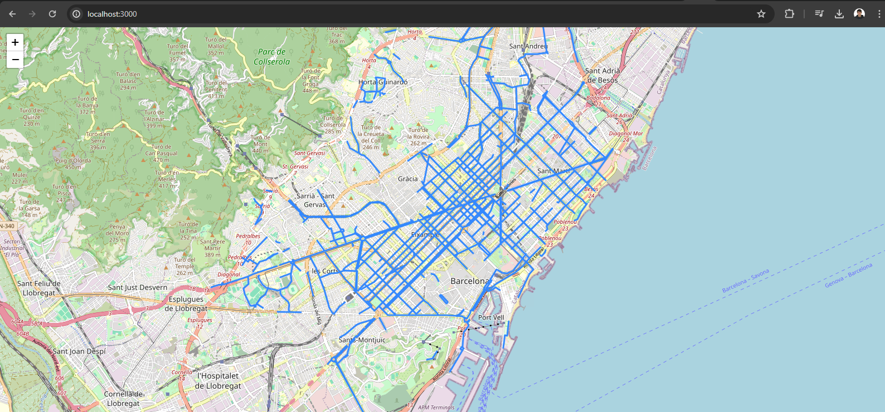

# BCN BikeLane Map

This project is part of the `Application Security Testing` workshop adapted to the SmartCities use case. It's an insecure app by definition

Please check out the workshop guide (https://github.com/TheMatrix97/AST_SmartCity_Lab) for more info



## Run

### NPM

```bash
npm install
npm run start
```

### Docker

```bash
docker build -t bikelanemap:latest .
docker run --rm -it -p 3000:3000 bikelanemap:latest
```

## Endpoints

Check the swagger for more info `http://localhost:3000/api/doc`